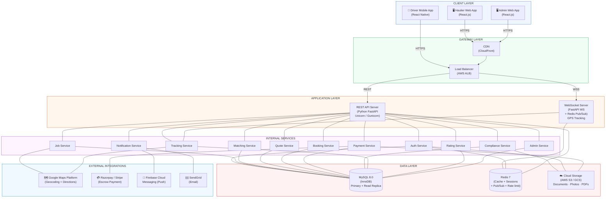

# Diagram 01 – System Architecture

```mermaid
graph TB
    subgraph CLIENTS["CLIENT LAYER"]
        HW["🖥️ Haulier Web App<br/>(React.js)"]
        AW["🖥️ Admin Web App<br/>(React.js)"]
        DM["📱 Driver Mobile App<br/>(React Native)"]
    end

    subgraph GATEWAY["GATEWAY LAYER"]
        CDN["CDN<br/>(CloudFront)"]
        ALB["Load Balancer<br/>(AWS ALB)"]
    end

    subgraph API["APPLICATION LAYER"]
        REST["REST API Server<br/>(Python FastAPI<br/>Uvicorn / Gunicorn)"]
        WS["WebSocket Server<br/>(FastAPI WS<br/>+ Redis Pub/Sub)<br/>GPS Tracking"]
    end

    subgraph SERVICES["INTERNAL SERVICES"]
        AUTH["Auth Service"]
        JOB["Job Service"]
        MATCH["Matching Service"]
        QUOTE["Quote Service"]
        BOOK["Booking Service"]
        PAY["Payment Service"]
        COMP["Compliance Service"]
        TRACK["Tracking Service"]
        NOTIF["Notification Service"]
        RATE["Rating Service"]
        ADMIN["Admin Service"]
    end

    subgraph DATA["DATA LAYER"]
        PG[("MySQL 8.0<br/>(InnoDB)<br/>Primary + Read Replica")]
        RD[("Redis 7<br/>(Cache + Sessions<br/>+ Pub/Sub + Rate limit)")]
        S3["☁️ Cloud Storage<br/>(AWS S3 / GCS)<br/>Documents · Photos · PDFs"]
    end

    subgraph EXTERNAL["EXTERNAL INTEGRATIONS"]
        MAPS["🗺️ Google Maps Platform<br/>(Geocoding + Directions)"]
        PGWY["💳 Razorpay / Stripe<br/>(Escrow Payment)"]
        FCM["🔔 Firebase Cloud<br/>Messaging (Push)"]
        SG["✉️ SendGrid<br/>(Email)"]
    end

    HW -->|HTTPS| CDN
    AW -->|HTTPS| CDN
    DM -->|HTTPS| ALB
    CDN --> ALB
    ALB -->|REST| REST
    ALB -->|WSS| WS

    REST --- AUTH
    REST --- JOB
    REST --- MATCH
    REST --- QUOTE
    REST --- BOOK
    REST --- PAY
    REST --- COMP
    REST --- TRACK
    REST --- NOTIF
    REST --- RATE
    REST --- ADMIN

    WS --- TRACK
    WS --- RD

    AUTH --- PG
    JOB --- PG
    MATCH --- PG
    QUOTE --- PG
    BOOK --- PG
    PAY --- PG
    COMP --- PG
    TRACK --- PG
    RATE --- PG
    ADMIN --- PG

    AUTH --- RD
    REST --- RD

    COMP --- S3
    AUTH --- S3
    PAY --- S3

    JOB --- MAPS
    TRACK --- MAPS
    PAY --- PGWY
    NOTIF --- FCM
    NOTIF --- SG

    style CLIENTS fill:#EFF6FF,stroke:#2563EB
    style GATEWAY fill:#F0FDF4,stroke:#16A34A
    style API fill:#FFF7ED,stroke:#EA580C
    style SERVICES fill:#FDF4FF,stroke:#9333EA
    style DATA fill:#FEF2F2,stroke:#DC2626
    style EXTERNAL fill:#F0F9FF,stroke:#0284C7
```
