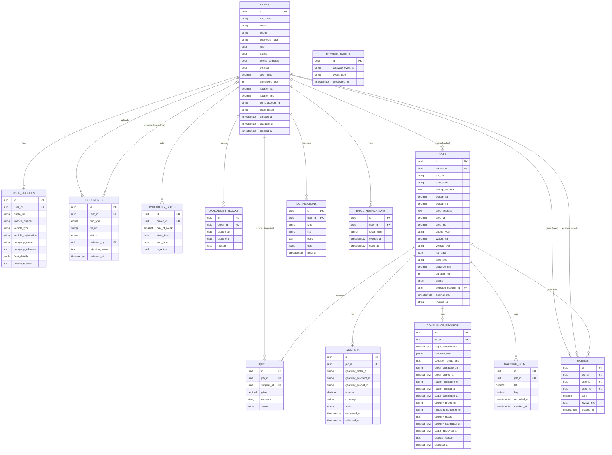

# Diagram 02 – Entity Relationship Diagram (ERD)

```mermaid
erDiagram
    USERS {
        uuid id PK
        string full_name
        string email
        string phone
        string password_hash
        enum role
        enum status
        bool profile_complete
        bool verified
        decimal avg_rating
        int completed_jobs
        decimal location_lat
        decimal location_lng
        string bank_account_id
        string push_token
        timestamptz created_at
        timestamptz updated_at
        timestamptz deleted_at
    }

    USER_PROFILES {
        uuid id PK
        uuid user_id FK
        string photo_url
        string licence_number
        string vehicle_type
        string vehicle_registration
        string company_name
        text company_address
        jsonb fleet_details
        text coverage_area
    }

    DOCUMENTS {
        uuid id PK
        uuid user_id FK
        enum doc_type
        string file_url
        enum status
        uuid reviewed_by FK
        text rejection_reason
        timestamptz reviewed_at
    }

    AVAILABILITY_SLOTS {
        uuid id PK
        uuid driver_id FK
        smallint day_of_week
        time start_time
        time end_time
        bool is_active
    }

    AVAILABILITY_BLOCKS {
        uuid id PK
        uuid driver_id FK
        date block_start
        date block_end
        text reason
    }

    JOBS {
        uuid id PK
        uuid haulier_id FK
        string job_ref
        string load_code
        text pickup_address
        decimal pickup_lat
        decimal pickup_lng
        text drop_address
        decimal drop_lat
        decimal drop_lng
        string goods_type
        decimal weight_kg
        string vehicle_type
        date job_date
        string time_slot
        decimal distance_km
        int duration_min
        enum status
        uuid selected_supplier_id FK
        timestamptz original_eta
        string invoice_url
    }

    QUOTES {
        uuid id PK
        uuid job_id FK
        uuid supplier_id FK
        decimal price
        string currency
        enum status
    }

    PAYMENTS {
        uuid id PK
        uuid job_id FK
        string gateway_order_id
        string gateway_payment_id
        string gateway_payout_id
        decimal amount
        string currency
        enum status
        timestamptz escrowed_at
        timestamptz released_at
    }

    COMPLIANCE_RECORDS {
        uuid id PK
        uuid job_id FK
        timestamptz step1_completed_at
        jsonb checklist_data
        text[] condition_photo_urls
        string driver_signature_url
        timestamptz driver_signed_at
        string haulier_signature_url
        timestamptz haulier_signed_at
        timestamptz step2_completed_at
        string delivery_photo_url
        string recipient_signature_url
        text delivery_notes
        timestamptz delivery_submitted_at
        timestamptz step3_approved_at
        text dispute_reason
        timestamptz disputed_at
    }

    TRACKING_POINTS {
        uuid id PK
        uuid job_id FK
        decimal lat
        decimal lng
        timestamptz recorded_at
        timestamptz created_at
    }

    RATINGS {
        uuid id PK
        uuid job_id FK
        uuid rater_id FK
        uuid rated_id FK
        smallint stars
        text review_text
        timestamptz created_at
    }

    NOTIFICATIONS {
        uuid id PK
        uuid user_id FK
        string type
        string title
        text body
        jsonb data
        timestamptz read_at
    }

    EMAIL_VERIFICATIONS {
        uuid id PK
        uuid user_id FK
        string token_hash
        timestamptz expires_at
        timestamptz used_at
    }

    PAYMENT_EVENTS {
        uuid id PK
        string gateway_event_id
        string event_type
        timestamptz processed_at
    }

    USERS ||--o{ DOCUMENTS : "uploads"
    USERS ||--o| USER_PROFILES : "has"
    USERS ||--o{ AVAILABILITY_SLOTS : "sets"
    USERS ||--o{ AVAILABILITY_BLOCKS : "blocks"
    USERS ||--o{ JOBS : "posts (haulier)"
    USERS ||--o{ QUOTES : "submits (supplier)"
    USERS ||--o{ NOTIFICATIONS : "receives"
    USERS ||--o{ EMAIL_VERIFICATIONS : "has"
    USERS ||--o{ RATINGS : "gives (rater)"
    USERS ||--o{ RATINGS : "receives (rated)"

    JOBS ||--o{ QUOTES : "receives"
    JOBS ||--o| PAYMENTS : "has"
    JOBS ||--o| COMPLIANCE_RECORDS : "has"
    JOBS ||--o{ TRACKING_POINTS : "logs"
    JOBS ||--o{ RATINGS : "generates"

    DOCUMENTS }o--o| USERS : "reviewed by (admin)"
```
