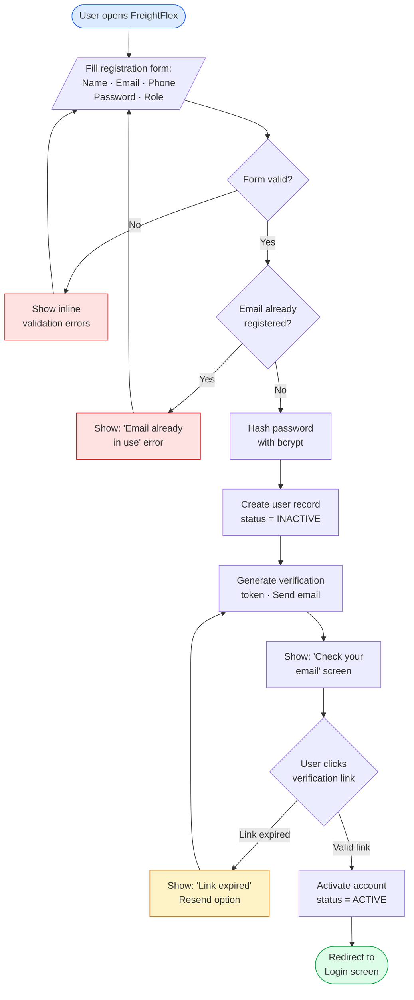
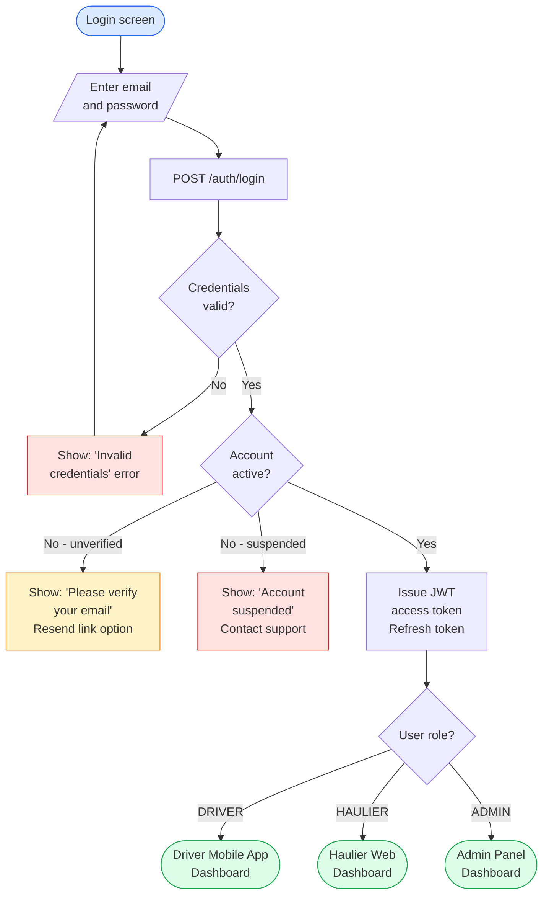
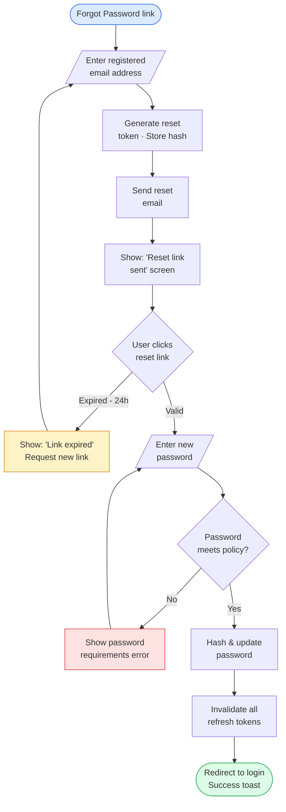

# Diagram 03 – User Registration & Login Flow

## 3A – Registration Flow

```mermaid
flowchart TD
    A([User opens FreightFlex]) --> B[/Fill registration form:\nName · Email · Phone\nPassword · Role/]
    B --> C{Form valid?}
    C -->|No| D[Show inline\nvalidation errors]
    D --> B
    C -->|Yes| E{Email already\nregistered?}
    E -->|Yes| F[Show: 'Email already\nin use' error]
    F --> B
    E -->|No| G[Hash password\nwith bcrypt]
    G --> H[Create user record\nstatus = INACTIVE]
    H --> I[Generate verification\ntoken · Send email]
    I --> J[Show: 'Check your\nemail' screen]
    J --> K{User clicks\nverification link}
    K -->|Link expired| L[Show: 'Link expired'\nResend option]
    L --> I
    K -->|Valid link| M[Activate account\nstatus = ACTIVE]
    M --> N([Redirect to\nLogin screen])

    style A fill:#DBEAFE,stroke:#2563EB
    style N fill:#DCFCE7,stroke:#16A34A
    style D fill:#FEE2E2,stroke:#DC2626
    style F fill:#FEE2E2,stroke:#DC2626
    style L fill:#FEF3C7,stroke:#D97706
```

## 3B – Login & Role-Based Redirect Flow

```mermaid
flowchart TD
    A([Login screen]) --> B[/Enter email\nand password/]
    B --> C[POST /auth/login]
    C --> D{Credentials\nvalid?}
    D -->|No| E[Show: 'Invalid\ncredentials' error]
    E --> B
    D -->|Yes| F{Account\nactive?}
    F -->|No - unverified| G[Show: 'Please verify\nyour email'\nResend link option]
    F -->|No - suspended| H[Show: 'Account\nsuspended'\nContact support]
    F -->|Yes| I[Issue JWT\naccess token\nRefresh token]
    I --> J{User role?}
    J -->|DRIVER| K([Driver Mobile App\nDashboard])
    J -->|HAULIER| L([Haulier Web\nDashboard])
    J -->|ADMIN| M([Admin Panel\nDashboard])

    style A fill:#DBEAFE,stroke:#2563EB
    style K fill:#DCFCE7,stroke:#16A34A
    style L fill:#DCFCE7,stroke:#16A34A
    style M fill:#DCFCE7,stroke:#16A34A
    style E fill:#FEE2E2,stroke:#DC2626
    style G fill:#FEF3C7,stroke:#D97706
    style H fill:#FEE2E2,stroke:#DC2626
```

## 3C – Forgot Password Flow

```mermaid
flowchart TD
    A([Forgot Password link]) --> B[/Enter registered\nemail address/]
    B --> C[Generate reset\ntoken · Store hash]
    C --> D[Send reset\nemail]
    D --> E[Show: 'Reset link\nsent' screen]
    E --> F{User clicks\nreset link}
    F -->|Expired - 24h| G[Show: 'Link expired'\nRequest new link]
    G --> B
    F -->|Valid| H[/Enter new\npassword/]
    H --> I{Password\nmeets policy?}
    I -->|No| J[Show password\nrequirements error]
    J --> H
    I -->|Yes| K[Hash & update\npassword]
    K --> L[Invalidate all\nrefresh tokens]
    L --> M([Redirect to login\nSuccess toast])

    style A fill:#DBEAFE,stroke:#2563EB
    style M fill:#DCFCE7,stroke:#16A34A
    style G fill:#FEF3C7,stroke:#D97706
    style J fill:#FEE2E2,stroke:#DC2626
```
