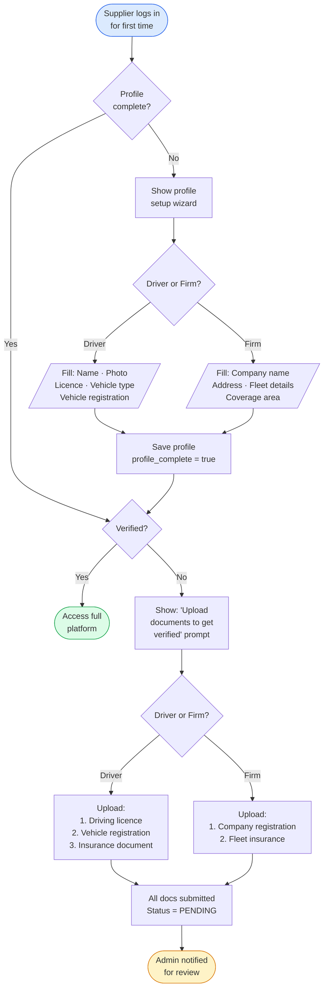
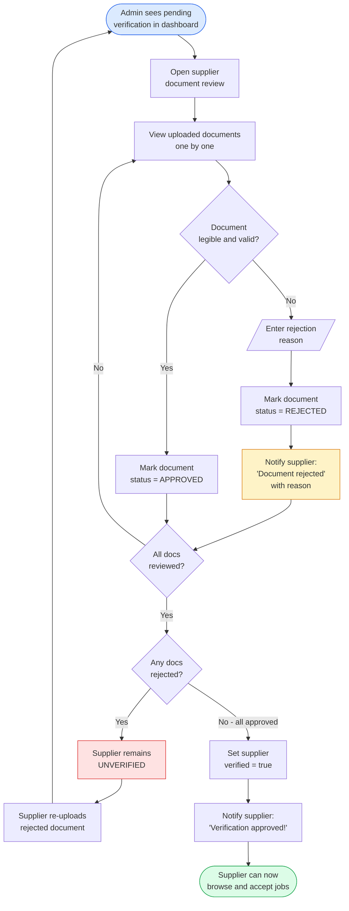
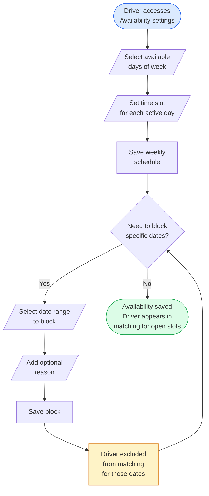

# Diagram 04 – Supplier Onboarding & Verification Flow

## 4A – Supplier Profile & Document Upload Flow

```mermaid
flowchart TD
    A([Supplier logs in\nfor first time]) --> B{Profile\ncomplete?}
    B -->|No| C[Show profile\nsetup wizard]
    C --> D{Driver or Firm?}
    D -->|Driver| E[/Fill: Name · Photo\nLicence · Vehicle type\nVehicle registration/]
    D -->|Firm| F[/Fill: Company name\nAddress · Fleet details\nCoverage area/]
    E --> G[Save profile\nprofile_complete = true]
    F --> G
    B -->|Yes| H{Verified?}
    G --> H
    H -->|Yes| I([Access full\nplatform])
    H -->|No| J[Show: 'Upload\ndocuments to get\nverified' prompt]
    J --> K{Driver or Firm?}
    K -->|Driver| L[Upload:\n1. Driving licence\n2. Vehicle registration\n3. Insurance document]
    K -->|Firm| M[Upload:\n1. Company registration\n2. Fleet insurance]
    L --> N[All docs submitted\nStatus = PENDING]
    M --> N
    N --> O([Admin notified\nfor review])

    style A fill:#DBEAFE,stroke:#2563EB
    style I fill:#DCFCE7,stroke:#16A34A
    style O fill:#FEF3C7,stroke:#D97706
```

## 4B – Admin Document Verification Flow

```mermaid
flowchart TD
    A([Admin sees pending\nverification in dashboard]) --> B[Open supplier\ndocument review]
    B --> C[View uploaded documents\none by one]
    C --> D{Document\nlegible and valid?}
    D -->|No| E[/Enter rejection\nreason/]
    E --> F[Mark document\nstatus = REJECTED]
    F --> G[Notify supplier:\n'Document rejected'\nwith reason]
    G --> H{All docs\nreviewed?}
    D -->|Yes| I[Mark document\nstatus = APPROVED]
    I --> H
    H -->|No| C
    H -->|Yes| J{Any docs\nrejected?}
    J -->|Yes| K[Supplier remains\nUNVERIFIED]
    K --> L[Supplier re-uploads\nrejected document]
    L --> A
    J -->|No - all approved| M[Set supplier\nverified = true]
    M --> N[Notify supplier:\n'Verification approved!']
    N --> O([Supplier can now\nbrowse and accept jobs])

    style A fill:#DBEAFE,stroke:#2563EB
    style O fill:#DCFCE7,stroke:#16A34A
    style K fill:#FEE2E2,stroke:#DC2626
    style G fill:#FEF3C7,stroke:#D97706
```

## 4C – Driver Availability Setup Flow

```mermaid
flowchart TD
    A([Driver accesses\nAvailability settings]) --> B[/Select available\ndays of week/]
    B --> C[/Set time slot\nfor each active day/]
    C --> D[Save weekly\nschedule]
    D --> E{Need to block\nspecific dates?}
    E -->|Yes| F[/Select date range\nto block/]
    F --> G[/Add optional\nreason/]
    G --> H[Save block]
    H --> I[Driver excluded\nfrom matching\nfor those dates]
    I --> E
    E -->|No| J([Availability saved\nDriver appears in\nmatching for open slots])

    style A fill:#DBEAFE,stroke:#2563EB
    style J fill:#DCFCE7,stroke:#16A34A
    style I fill:#FEF3C7,stroke:#D97706
```
