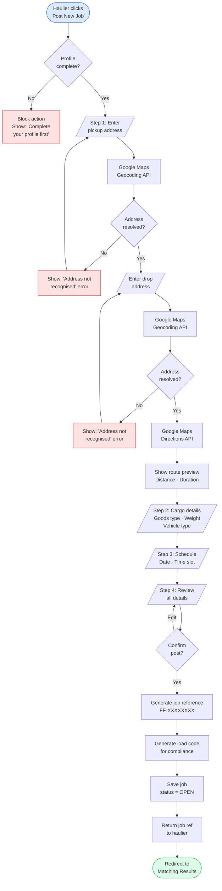
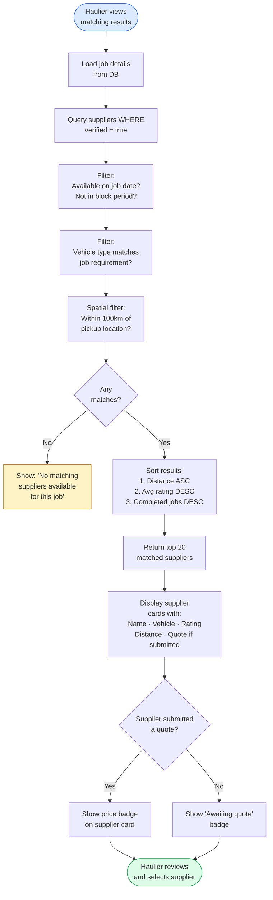
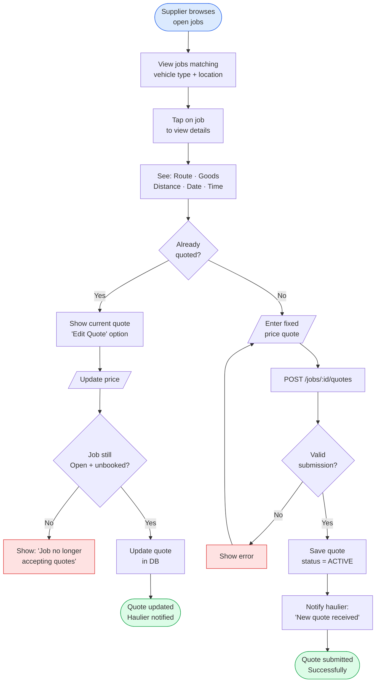

# Diagram 05 – Job Posting & Supplier Matching Flow

## 5A – Job Posting Flow

```mermaid
flowchart TD
    A([Haulier clicks\n'Post New Job']) --> B{Profile\ncomplete?}
    B -->|No| C[Block action\nShow: 'Complete\nyour profile first']
    B -->|Yes| D[/Step 1: Enter\npickup address/]
    D --> E[Google Maps\nGeocoding API]
    E --> F{Address\nresolved?}
    F -->|No| G[Show: 'Address not\nrecognised' error]
    G --> D
    F -->|Yes| H[/Enter drop\naddress/]
    H --> I[Google Maps\nGeocoding API]
    I --> J{Address\nresolved?}
    J -->|No| K[Show: 'Address not\nrecognised' error]
    K --> H
    J -->|Yes| L[Google Maps\nDirections API]
    L --> M[Show route preview\nDistance · Duration]
    M --> N[/Step 2: Cargo details\nGoods type · Weight\nVehicle type/]
    N --> O[/Step 3: Schedule\nDate · Time slot/]
    O --> P[/Step 4: Review\nall details/]
    P --> Q{Confirm\npost?}
    Q -->|Edit| P
    Q -->|Yes| R[Generate job reference\nFF-XXXXXXXX]
    R --> S[Generate load code\nfor compliance]
    S --> T[Save job\nstatus = OPEN]
    T --> U[Return job ref\nto haulier]
    U --> V([Redirect to\nMatching Results])

    style A fill:#DBEAFE,stroke:#2563EB
    style V fill:#DCFCE7,stroke:#16A34A
    style C fill:#FEE2E2,stroke:#DC2626
    style G fill:#FEE2E2,stroke:#DC2626
    style K fill:#FEE2E2,stroke:#DC2626
```

## 5B – Supplier Matching Algorithm Flow

```mermaid
flowchart TD
    A([Haulier views\nmatching results]) --> B[Load job details\nfrom DB]
    B --> C[Query suppliers WHERE\nverified = true]
    C --> D[Filter:\nAvailable on job date?\nNot in block period?]
    D --> E[Filter:\nVehicle type matches\njob requirement?]
    E --> F[Spatial filter:\nWithin 100km of\npickup location?]
    F --> G{Any\nmatches?}
    G -->|No| H[Show: 'No matching\nsuppliers available\nfor this job']
    G -->|Yes| I[Sort results:\n1. Distance ASC\n2. Avg rating DESC\n3. Completed jobs DESC]
    I --> J[Return top 20\nmatched suppliers]
    J --> K[Display supplier\ncards with:\nName · Vehicle · Rating\nDistance · Quote if submitted]
    K --> L{Supplier submitted\na quote?}
    L -->|Yes| M[Show price badge\non supplier card]
    L -->|No| N[Show 'Awaiting quote'\nbadge]
    M --> O([Haulier reviews\nand selects supplier])
    N --> O

    style A fill:#DBEAFE,stroke:#2563EB
    style O fill:#DCFCE7,stroke:#16A34A
    style H fill:#FEF3C7,stroke:#D97706
```

## 5C – Quote Submission Flow (Supplier)

```mermaid
flowchart TD
    A([Supplier browses\nopen jobs]) --> B[View jobs matching\nvehicle type + location]
    B --> C[Tap on job\nto view details]
    C --> D[See: Route · Goods\nDistance · Date · Time]
    D --> E{Already\nquoted?}
    E -->|Yes| F[Show current quote\n'Edit Quote' option]
    F --> G[/Update price/]
    G --> H{Job still\nOpen + unbooked?}
    H -->|No| I[Show: 'Job no longer\naccepting quotes']
    H -->|Yes| J[Update quote\nin DB]
    J --> K([Quote updated\nHaulier notified])
    E -->|No| L[/Enter fixed\nprice quote/]
    L --> M[POST /jobs/:id/quotes]
    M --> N{Valid\nsubmission?}
    N -->|No| O[Show error]
    O --> L
    N -->|Yes| P[Save quote\nstatus = ACTIVE]
    P --> Q[Notify haulier:\n'New quote received']
    Q --> R([Quote submitted\nSuccessfully])

    style A fill:#DBEAFE,stroke:#2563EB
    style K fill:#DCFCE7,stroke:#16A34A
    style R fill:#DCFCE7,stroke:#16A34A
    style I fill:#FEE2E2,stroke:#DC2626
    style O fill:#FEE2E2,stroke:#DC2626
```
