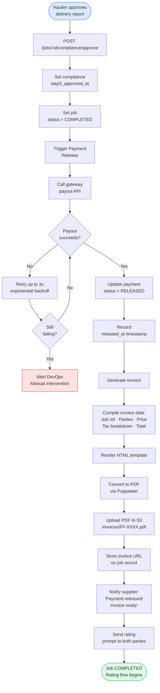

# Diagram 06 – Booking & Escrow Payment Flow

## 6A – Booking Confirmation Flow

```mermaid
flowchart TD
    A([Haulier views\nquote comparison table]) --> B[Review all submitted\nquotes: Name · Rating · Price]
    B --> C[/Select preferred\nsupplier/]
    C --> D[Confirmation modal:\n'Book [Supplier] for £XXX?']
    D --> E{Confirm?}
    E -->|Cancel| B
    E -->|Yes| F[POST /jobs/:id/book\nwith quoteId]
    F --> G[Set job\nstatus = BOOKED]
    G --> H[Set selected\nsupplier on job]
    H --> I[Mark selected quote\nstatus = SELECTED]
    I --> J[Mark all other\nquotes = REJECTED]
    J --> K[Notify selected\nsupplier:\n'You have been booked!']
    K --> L[Notify rejected\nsuppliers:\n'Another supplier selected']
    L --> M([Redirect to\nEscrow Payment screen])

    style A fill:#DBEAFE,stroke:#2563EB
    style M fill:#DCFCE7,stroke:#16A34A
```

## 6B – Escrow Payment Flow

```mermaid
flowchart TD
    A([Haulier on\nPayment screen]) --> B[Display:\nJob ref · Supplier\nPrice · Tax · Total]
    B --> C[/Select payment\nmethod:\nUPI · Card · Bank Transfer/]
    C --> D[POST /jobs/:id/payment/initiate]
    D --> E[Create payment order\nat gateway]
    E --> F[Return payment URL\nto frontend]
    F --> G[Redirect haulier to\ngateway payment page]
    G --> H{Payment\noutcome}
    H -->|User cancels| I[Return to\nFreightFlex\nPayment Pending]
    H -->|Payment fails| J[Gateway webhook:\npayment.failed]
    H -->|Payment succeeds| K[Gateway webhook:\npayment.captured]
    J --> L[Update payment\nstatus = FAILED]
    L --> M[Notify haulier:\n'Payment failed\nPlease retry']
    M --> A
    K --> N[Verify HMAC\nsignature]
    N --> O{Signature\nvalid?}
    O -->|No| P[Log error\nIgnore event]
    O -->|Yes| Q{Event already\nprocessed?]
    Q -->|Yes - duplicate| P
    Q -->|No| R[Update payment\nstatus = ESCROWED]
    R --> S[Update job\nstatus = PAYMENT_SECURED]
    S --> T[Notify supplier:\n'Payment secured ✓']
    T --> U[Show haulier:\n'Funds held in escrow']
    U --> V([Awaiting job\nexecution])

    style A fill:#DBEAFE,stroke:#2563EB
    style V fill:#DCFCE7,stroke:#16A34A
    style M fill:#FEE2E2,stroke:#DC2626
    style P fill:#FEE2E2,stroke:#DC2626
```

## 6C – Payment Release & Invoice Flow


