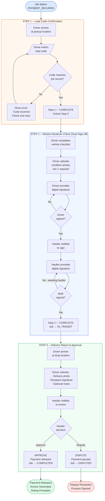
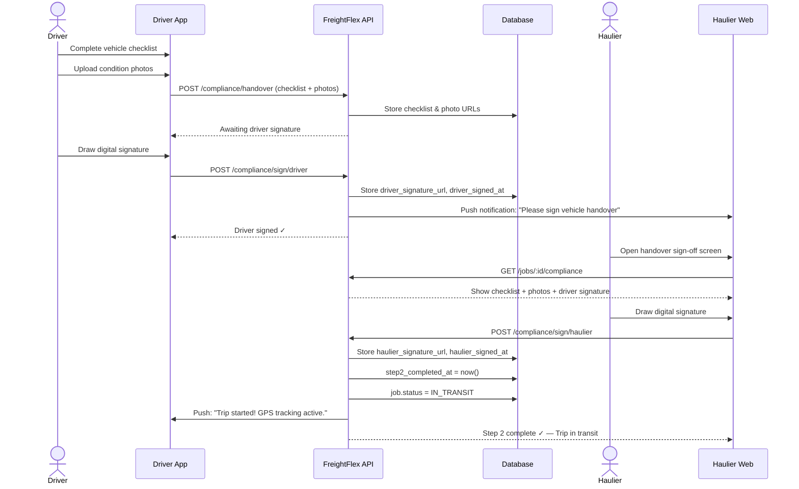
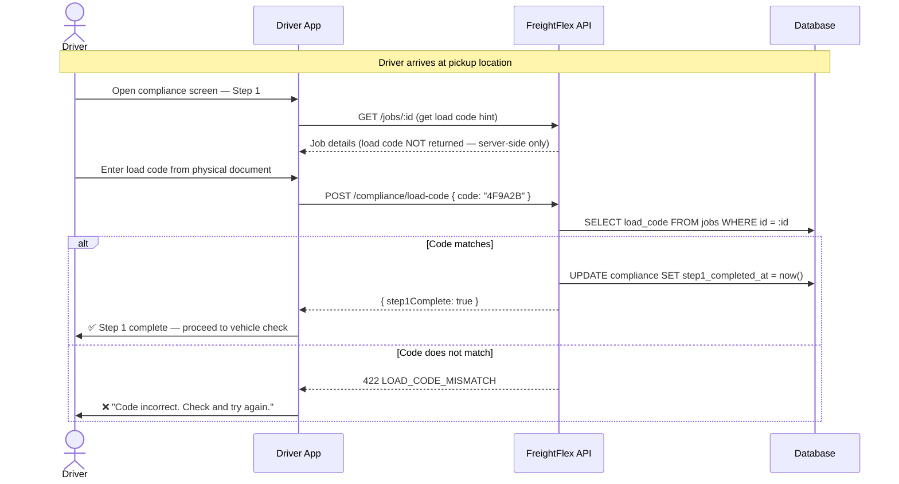

# Diagram 07 – Compliance Workflow (3-Step Chain)

## 7A – Full Compliance Chain Overview

```mermaid
flowchart TD
    START([Job status:\nPAYMENT_SECURED]) --> S1

    subgraph S1["STEP 1 – Load Code Confirmation"]
        A1[Driver arrives\nat pickup location]
        B1[/Driver enters\nload code/]
        C1{Code matches\njob record?}
        D1[Show error:\n'Code incorrect\nCheck and retry']
        E1[Step 1 ✅ COMPLETE\nUnlock Step 2]
        A1 --> B1 --> C1
        C1 -->|No| D1 --> B1
        C1 -->|Yes| E1
    end

    E1 --> S2

    subgraph S2["STEP 2 – Vehicle Handover Check (Dual Sign-off)"]
        A2[Driver completes\nvehicle checklist]
        B2[Driver uploads\ncondition photos\nmin 1 required]
        C2[Driver provides\ndigital signature]
        D2{Driver\nsigned?}
        E2[Haulier notified\nto sign]
        F2[Haulier provides\ndigital signature]
        G2{Both\nsigned?}
        H2[Step 2 ✅ COMPLETE\nJob → IN_TRANSIT]
        A2 --> B2 --> C2 --> D2
        D2 -->|Yes| E2 --> F2 --> G2
        D2 -->|No| C2
        G2 -->|No - awaiting haulier| F2
        G2 -->|Yes| H2
    end

    H2 --> S3

    subgraph S3["STEP 3 – Delivery Report & Approval"]
        A3[Driver arrives\nat drop location]
        B3[Driver submits:\n- Delivery photo\n- Recipient signature\n- Optional notes]
        C3[Haulier notified\nto review]
        D3{Haulier\ndecision}
        E3[APPROVE\nPayment released\nJob → COMPLETED]
        F3[DISPUTE\nPayment paused\nJob → DISPUTED]
        A3 --> B3 --> C3 --> D3
        D3 -->|Approve| E3
        D3 -->|Dispute| F3
    end

    E3 --> END1([Payment Released\nInvoice Generated\nRating Prompted])
    F3 --> END2([Dispute Resolution\nProcess Opened])

    style START fill:#DBEAFE,stroke:#2563EB
    style END1 fill:#DCFCE7,stroke:#16A34A
    style END2 fill:#FEE2E2,stroke:#DC2626
    style S1 fill:#FFF7ED,stroke:#EA580C
    style S2 fill:#EFF6FF,stroke:#2563EB
    style S3 fill:#F0FDF4,stroke:#16A34A
```

## 7B – Step 2 Dual Sign-off Detail (Sequence)

```mermaid
sequenceDiagram
    actor Driver
    participant App as Driver App
    participant API as FreightFlex API
    participant DB as Database
    actor Haulier
    participant HWeb as Haulier Web

    Driver->>App: Complete vehicle checklist
    Driver->>App: Upload condition photos
    App->>API: POST /compliance/handover (checklist + photos)
    API->>DB: Store checklist & photo URLs
    API-->>App: Awaiting driver signature

    Driver->>App: Draw digital signature
    App->>API: POST /compliance/sign/driver
    API->>DB: Store driver_signature_url, driver_signed_at
    API->>HWeb: Push notification: "Please sign vehicle handover"
    API-->>App: Driver signed ✓

    Haulier->>HWeb: Open handover sign-off screen
    HWeb->>API: GET /jobs/:id/compliance
    API-->>HWeb: Show checklist + photos + driver signature
    Haulier->>HWeb: Draw digital signature
    HWeb->>API: POST /compliance/sign/haulier
    API->>DB: Store haulier_signature_url, haulier_signed_at
    API->>DB: step2_completed_at = now()
    API->>DB: job.status = IN_TRANSIT
    API->>App: Push: "Trip started! GPS tracking active."
    API-->>HWeb: Step 2 complete ✓ — Trip in transit
```

## 7C – Step 1 Load Code Verification (Detail)

```mermaid
sequenceDiagram
    actor Driver
    participant App as Driver App
    participant API as FreightFlex API
    participant DB as Database

    Note over Driver,DB: Driver arrives at pickup location

    Driver->>App: Open compliance screen — Step 1
    App->>API: GET /jobs/:id (get load code hint)
    API-->>App: Job details (load code NOT returned — server-side only)

    Driver->>App: Enter load code from physical document
    App->>API: POST /compliance/load-code { code: "4F9A2B" }
    API->>DB: SELECT load_code FROM jobs WHERE id = :id
    
    alt Code matches
        API->>DB: UPDATE compliance SET step1_completed_at = now()
        API-->>App: { step1Complete: true }
        App->>Driver: ✅ Step 1 complete — proceed to vehicle check
    else Code does not match
        API-->>App: 422 LOAD_CODE_MISMATCH
        App->>Driver: ❌ "Code incorrect. Check and try again."
    end
```
