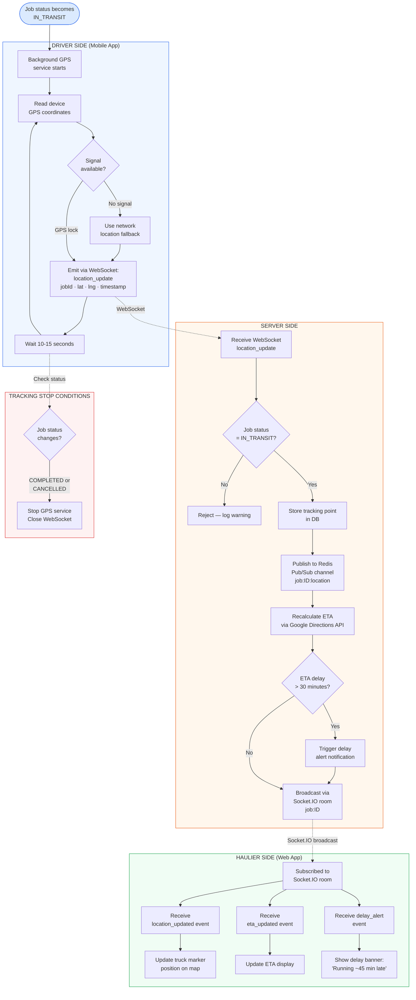
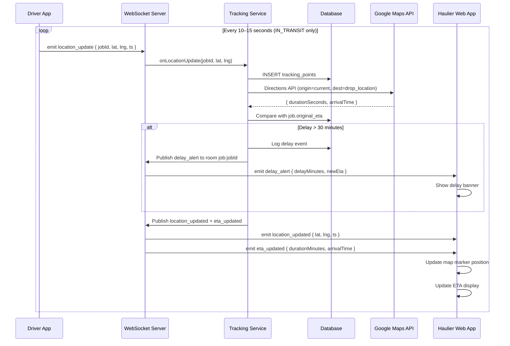
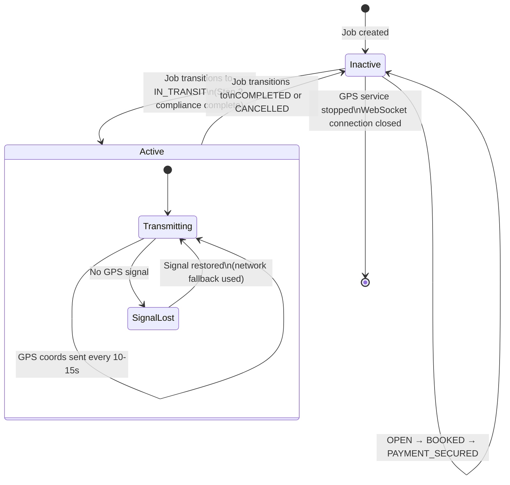

# Diagram 08 – Live GPS Tracking & ETA Flow

## 8A – GPS Tracking Data Flow

```mermaid
flowchart TD
    A([Job status becomes\nIN_TRANSIT]) --> B

    subgraph DRIVER["DRIVER SIDE (Mobile App)"]
        B[Background GPS\nservice starts]
        C[Read device\nGPS coordinates]
        D{Signal\navailable?}
        E[Use network\nlocation fallback]
        F[Emit via WebSocket:\nlocation_update\njobId · lat · lng · timestamp]
        G[Wait 10-15 seconds]
        B --> C --> D
        D -->|No signal| E --> F
        D -->|GPS lock| F
        F --> G --> C
    end

    subgraph SERVER["SERVER SIDE"]
        H[Receive WebSocket\nlocation_update]
        I{Job status\n= IN_TRANSIT?}
        J[Reject — log warning]
        K[Store tracking point\nin DB]
        L[Publish to Redis\nPub/Sub channel\njob:ID:location]
        M[Recalculate ETA\nvia Google Directions API]
        N{ETA delay\n> 30 minutes?}
        O[Trigger delay\nalert notification]
        P[Broadcast via\nSocket.IO room\njob:ID]
        H --> I
        I -->|No| J
        I -->|Yes| K --> L --> M --> N
        N -->|Yes| O --> P
        N -->|No| P
    end

    subgraph HAULIER["HAULIER SIDE (Web App)"]
        Q[Subscribed to\nSocket.IO room]
        R[Receive\nlocation_updated event]
        S[Update truck marker\nposition on map]
        T[Receive\neta_updated event]
        U[Update ETA display]
        V[Receive delay_alert\nevent]
        W[Show delay banner:\n'Running ~45 min late']
        Q --> R --> S
        Q --> T --> U
        Q --> V --> W
    end

    F -.->|WebSocket| H
    P -.->|Socket.IO broadcast| Q

    subgraph STOP["TRACKING STOP CONDITIONS"]
        X{Job status\nchanges?}
        Y[Stop GPS service\nClose WebSocket]
        X -->|COMPLETED or\nCANCELLED| Y
    end

    G -.->|Check status| X

    style A fill:#DBEAFE,stroke:#2563EB
    style DRIVER fill:#EFF6FF,stroke:#2563EB
    style SERVER fill:#FFF7ED,stroke:#EA580C
    style HAULIER fill:#F0FDF4,stroke:#16A34A
    style STOP fill:#FEF2F2,stroke:#DC2626
```

## 8B – ETA Calculation Sequence

```mermaid
sequenceDiagram
    participant DA as Driver App
    participant WS as WebSocket Server
    participant TS as Tracking Service
    participant DB as Database
    participant MAPS as Google Maps API
    participant HW as Haulier Web App

    loop Every 10–15 seconds (IN_TRANSIT only)
        DA->>WS: emit location_update { jobId, lat, lng, ts }
        WS->>TS: onLocationUpdate(jobId, lat, lng)
        TS->>DB: INSERT tracking_points
        TS->>MAPS: Directions API (origin=current, dest=drop_location)
        MAPS-->>TS: { durationSeconds, arrivalTime }
        TS->>DB: Compare with job.original_eta
        
        alt Delay > 30 minutes
            TS->>DB: Log delay event
            TS->>WS: Publish delay_alert to room job:jobId
            WS->>HW: emit delay_alert { delayMinutes, newEta }
            HW->>HW: Show delay banner
        end
        
        TS->>WS: Publish location_updated + eta_updated
        WS->>HW: emit location_updated { lat, lng, ts }
        WS->>HW: emit eta_updated { durationMinutes, arrivalTime }
        HW->>HW: Update map marker position
        HW->>HW: Update ETA display
    end
```

## 8C – Tracking Lifecycle State

```mermaid
stateDiagram-v2
    [*] --> Inactive : Job created

    Inactive --> Inactive : OPEN → BOOKED → PAYMENT_SECURED
    
    Inactive --> Active : Job transitions to IN_TRANSIT\n(Step 2 compliance complete)
    
    state Active {
        [*] --> Transmitting
        Transmitting --> Transmitting : GPS coords sent every 10-15s
        Transmitting --> SignalLost : No GPS signal
        SignalLost --> Transmitting : Signal restored\n(network fallback used)
    }
    
    Active --> Inactive : Job transitions to\nCOMPLETED or CANCELLED
    
    Inactive --> [*] : GPS service stopped\nWebSocket connection closed
```
