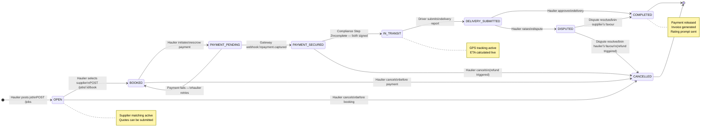
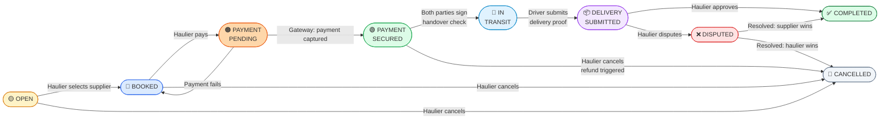
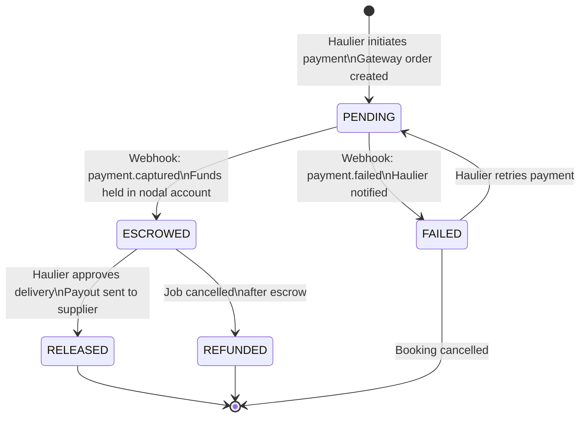
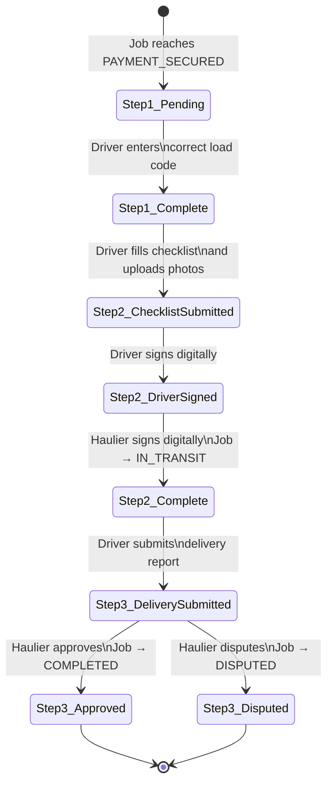

# Diagram 09 – Job Status State Machine (FSM)

## 9A – Full Job Lifecycle State Diagram

## 9B – Job Status Transitions with Actors

## 9C – Payment Status State Machine

## 9D – Compliance Record State Machine

