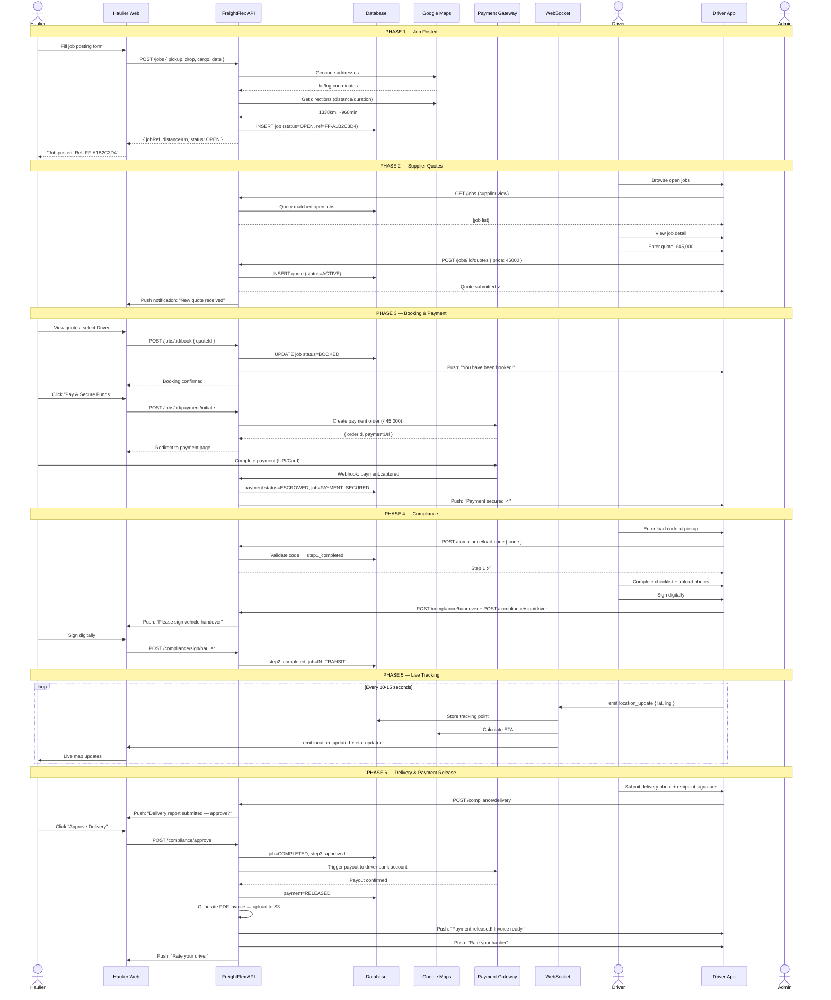
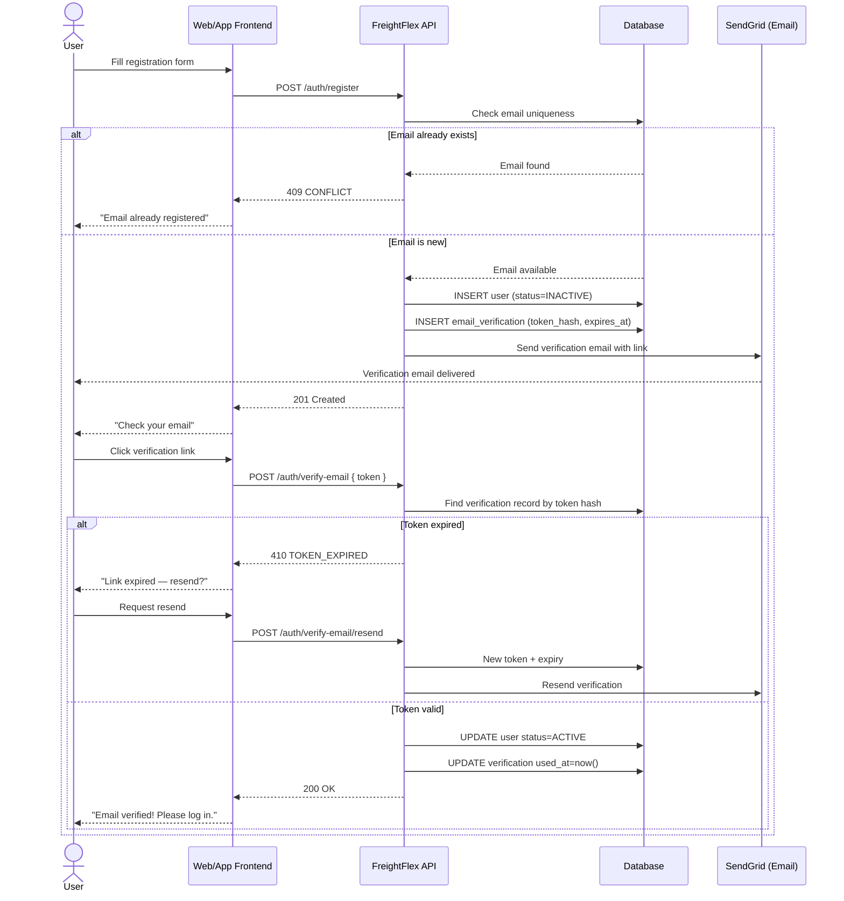
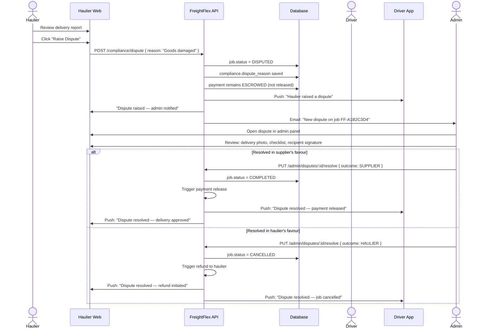

# Diagram 10 – End-to-End Sequence Diagrams

## 10A – Complete Happy Path (All Actors)

```mermaid
sequenceDiagram
    actor Haulier
    participant HWeb as Haulier Web
    participant API as FreightFlex API
    participant DB as Database
    participant Maps as Google Maps
    participant GW as Payment Gateway
    participant WS as WebSocket
    actor Driver
    participant DApp as Driver App
    actor Admin

    Note over Haulier,Admin: PHASE 1 — Job Posted

    Haulier->>HWeb: Fill job posting form
    HWeb->>API: POST /jobs { pickup, drop, cargo, date }
    API->>Maps: Geocode addresses
    Maps-->>API: lat/lng coordinates
    API->>Maps: Get directions (distance/duration)
    Maps-->>API: 1338km, ~960min
    API->>DB: INSERT job (status=OPEN, ref=FF-A1B2C3D4)
    API-->>HWeb: { jobRef, distanceKm, status: OPEN }
    HWeb-->>Haulier: "Job posted! Ref: FF-A1B2C3D4"

    Note over Haulier,Admin: PHASE 2 — Supplier Quotes

    Driver->>DApp: Browse open jobs
    DApp->>API: GET /jobs (supplier view)
    API->>DB: Query matched open jobs
    API-->>DApp: [job list]
    Driver->>DApp: View job detail
    Driver->>DApp: Enter quote: £45,000
    DApp->>API: POST /jobs/:id/quotes { price: 45000 }
    API->>DB: INSERT quote (status=ACTIVE)
    API-->>DApp: Quote submitted ✓
    API->>HWeb: Push notification: "New quote received"

    Note over Haulier,Admin: PHASE 3 — Booking & Payment

    Haulier->>HWeb: View quotes, select Driver
    HWeb->>API: POST /jobs/:id/book { quoteId }
    API->>DB: UPDATE job status=BOOKED
    API->>DApp: Push: "You have been booked!"
    API-->>HWeb: Booking confirmed
    Haulier->>HWeb: Click "Pay & Secure Funds"
    HWeb->>API: POST /jobs/:id/payment/initiate
    API->>GW: Create payment order (₹45,000)
    GW-->>API: { orderId, paymentUrl }
    API-->>HWeb: Redirect to payment page
    Haulier->>GW: Complete payment (UPI/Card)
    GW->>API: Webhook: payment.captured
    API->>DB: payment status=ESCROWED, job=PAYMENT_SECURED
    API->>DApp: Push: "Payment secured ✓"

    Note over Haulier,Admin: PHASE 4 — Compliance

    Driver->>DApp: Enter load code at pickup
    DApp->>API: POST /compliance/load-code { code }
    API->>DB: Validate code → step1_completed
    API-->>DApp: Step 1 ✅

    Driver->>DApp: Complete checklist + upload photos
    Driver->>DApp: Sign digitally
    DApp->>API: POST /compliance/handover + POST /compliance/sign/driver
    API->>HWeb: Push: "Please sign vehicle handover"
    Haulier->>HWeb: Sign digitally
    HWeb->>API: POST /compliance/sign/haulier
    API->>DB: step2_completed, job=IN_TRANSIT

    Note over Haulier,Admin: PHASE 5 — Live Tracking

    loop Every 10-15 seconds
        DApp->>WS: emit location_update { lat, lng }
        WS->>DB: Store tracking point
        WS->>Maps: Calculate ETA
        WS->>HWeb: emit location_updated + eta_updated
        HWeb->>Haulier: Live map updates
    end

    Note over Haulier,Admin: PHASE 6 — Delivery & Payment Release

    Driver->>DApp: Submit delivery photo + recipient signature
    DApp->>API: POST /compliance/delivery
    API->>HWeb: Push: "Delivery report submitted — approve?"
    Haulier->>HWeb: Click "Approve Delivery"
    HWeb->>API: POST /compliance/approve
    API->>DB: job=COMPLETED, step3_approved
    API->>GW: Trigger payout to driver bank account
    GW-->>API: Payout confirmed
    API->>DB: payment=RELEASED
    API->>API: Generate PDF invoice → upload to S3
    API->>DApp: Push: "Payment released! Invoice ready."
    API->>DApp: Push: "Rate your haulier"
    API->>HWeb: Push: "Rate your driver"
```

## 10B – Registration & Verification Sequence

```mermaid
sequenceDiagram
    actor User
    participant FE as Web/App Frontend
    participant API as FreightFlex API
    participant DB as Database
    participant Email as SendGrid (Email)

    User->>FE: Fill registration form
    FE->>API: POST /auth/register
    API->>DB: Check email uniqueness
    
    alt Email already exists
        DB-->>API: Email found
        API-->>FE: 409 CONFLICT
        FE-->>User: "Email already registered"
    else Email is new
        DB-->>API: Email available
        API->>DB: INSERT user (status=INACTIVE)
        API->>DB: INSERT email_verification (token_hash, expires_at)
        API->>Email: Send verification email with link
        Email-->>User: Verification email delivered
        API-->>FE: 201 Created
        FE-->>User: "Check your email"
        
        User->>FE: Click verification link
        FE->>API: POST /auth/verify-email { token }
        API->>DB: Find verification record by token hash
        
        alt Token expired
            API-->>FE: 410 TOKEN_EXPIRED
            FE-->>User: "Link expired — resend?"
            User->>FE: Request resend
            FE->>API: POST /auth/verify-email/resend
            API->>DB: New token + expiry
            API->>Email: Resend verification
        else Token valid
            API->>DB: UPDATE user status=ACTIVE
            API->>DB: UPDATE verification used_at=now()
            API-->>FE: 200 OK
            FE-->>User: "Email verified! Please log in."
        end
    end
```

## 10C – Dispute Resolution Sequence

```mermaid
sequenceDiagram
    actor Haulier
    participant HWeb as Haulier Web
    participant API as FreightFlex API
    participant DB as Database
    actor Driver
    participant DApp as Driver App
    actor Admin

    Haulier->>HWeb: Review delivery report
    Haulier->>HWeb: Click "Raise Dispute"
    HWeb->>API: POST /compliance/dispute { reason: "Goods damaged" }
    API->>DB: job.status = DISPUTED
    API->>DB: compliance.dispute_reason saved
    API->>DB: payment remains ESCROWED (not released)
    API->>DApp: Push: "Haulier raised a dispute"
    API->>HWeb: "Dispute raised — admin notified"
    API->>Admin: Email: "New dispute on job FF-A1B2C3D4"

    Admin->>HWeb: Open dispute in admin panel
    Admin->>HWeb: Review: delivery photo, checklist, recipient signature
    
    alt Resolved in supplier's favour
        Admin->>API: PUT /admin/disputes/:id/resolve { outcome: SUPPLIER }
        API->>DB: job.status = COMPLETED
        API->>API: Trigger payment release
        API->>DApp: Push: "Dispute resolved — payment released"
        API->>HWeb: Push: "Dispute resolved — delivery approved"
    else Resolved in haulier's favour
        Admin->>API: PUT /admin/disputes/:id/resolve { outcome: HAULIER }
        API->>DB: job.status = CANCELLED
        API->>API: Trigger refund to haulier
        API->>HWeb: Push: "Dispute resolved — refund initiated"
        API->>DApp: Push: "Dispute resolved — job cancelled"
    end
```
