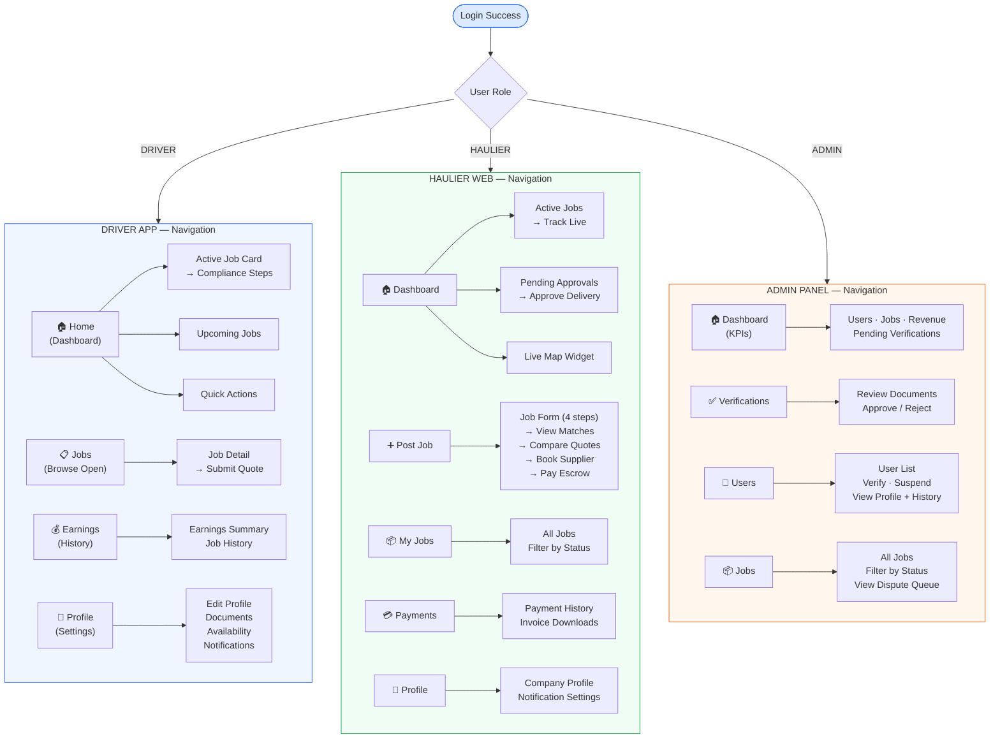
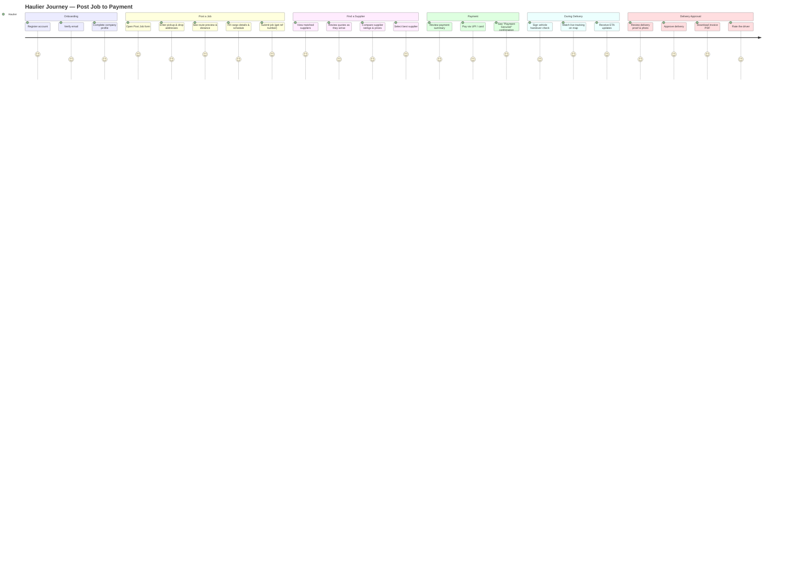
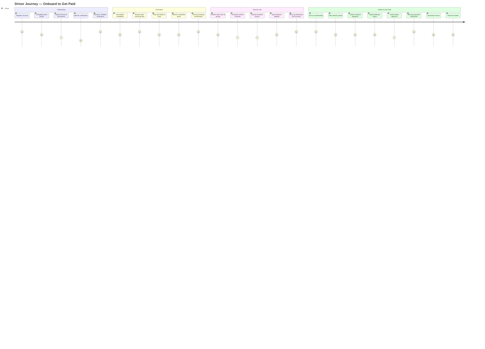

# Diagram 11 – User Role & Navigation Flow

## 11A – Role-Based Navigation Map

```mermaid
flowchart TD
    LOGIN([Login Success]) --> ROLE{User Role}

    ROLE -->|DRIVER| DAS
    ROLE -->|HAULIER| HAS
    ROLE -->|ADMIN| AAS

    subgraph DAS["DRIVER APP — Navigation"]
        D1["🏠 Home\n(Dashboard)"]
        D2["📋 Jobs\n(Browse Open)"]
        D3["💰 Earnings\n(History)"]
        D4["👤 Profile\n(Settings)"]

        D1 --> D1A["Active Job Card\n→ Compliance Steps"]
        D1 --> D1B["Upcoming Jobs"]
        D1 --> D1C["Quick Actions"]
        D2 --> D2A["Job Detail\n→ Submit Quote"]
        D3 --> D3A["Earnings Summary\nJob History"]
        D4 --> D4A["Edit Profile\nDocuments\nAvailability\nNotifications"]
    end

    subgraph HAS["HAULIER WEB — Navigation"]
        H1["🏠 Dashboard"]
        H2["➕ Post Job"]
        H3["📦 My Jobs"]
        H4["💳 Payments"]
        H5["👤 Profile"]

        H1 --> H1A["Active Jobs\n→ Track Live"]
        H1 --> H1B["Pending Approvals\n→ Approve Delivery"]
        H1 --> H1C["Live Map Widget"]
        H2 --> H2A["Job Form (4 steps)\n→ View Matches\n→ Compare Quotes\n→ Book Supplier\n→ Pay Escrow"]
        H3 --> H3A["All Jobs\nFilter by Status"]
        H4 --> H4A["Payment History\nInvoice Downloads"]
        H5 --> H5A["Company Profile\nNotification Settings"]
    end

    subgraph AAS["ADMIN PANEL — Navigation"]
        A1["🏠 Dashboard\n(KPIs)"]
        A2["✅ Verifications"]
        A3["👥 Users"]
        A4["📦 Jobs"]

        A1 --> A1A["Users · Jobs · Revenue\nPending Verifications"]
        A2 --> A2A["Review Documents\nApprove / Reject"]
        A3 --> A3A["User List\nVerify · Suspend\nView Profile + History"]
        A4 --> A4A["All Jobs\nFilter by Status\nView Dispute Queue"]
    end

    style LOGIN fill:#DBEAFE,stroke:#2563EB
    style DAS fill:#EFF6FF,stroke:#2563EB
    style HAS fill:#F0FDF4,stroke:#16A34A
    style AAS fill:#FFF7ED,stroke:#EA580C
```

## 11B – Haulier End-to-End Journey Map

```mermaid
journey
    title Haulier Journey — Post Job to Payment
    section Onboarding
      Register account: 5: Haulier
      Verify email: 4: Haulier
      Complete company profile: 4: Haulier
    section Post a Job
      Open Post Job form: 5: Haulier
      Enter pickup & drop addresses: 4: Haulier
      See route preview & distance: 5: Haulier
      Fill cargo details & schedule: 4: Haulier
      Submit job (get ref number): 5: Haulier
    section Find a Supplier
      View matched suppliers: 5: Haulier
      Review quotes as they arrive: 4: Haulier
      Compare supplier ratings & prices: 4: Haulier
      Select best supplier: 5: Haulier
    section Payment
      Review payment summary: 4: Haulier
      Pay via UPI / card: 4: Haulier
      See "Payment Secured" confirmation: 5: Haulier
    section During Delivery
      Sign vehicle handover check: 4: Haulier
      Watch live tracking on map: 5: Haulier
      Receive ETA updates: 5: Haulier
    section Delivery Approval
      Review delivery proof & photo: 4: Haulier
      Approve delivery: 5: Haulier
      Download invoice PDF: 5: Haulier
      Rate the driver: 4: Haulier
```

## 11C – Driver Journey Map

```mermaid
journey
    title Driver Journey — Onboard to Get Paid
    section Onboarding
      Register account: 5: Driver
      Complete driver profile: 4: Driver
      Upload licence & documents: 3: Driver
      Wait for verification: 2: Driver
      Receive "Verified" notification: 5: Driver
    section Find Work
      Set weekly availability: 4: Driver
      Browse open matching jobs: 5: Driver
      View job details & route: 4: Driver
      Submit competitive quote: 4: Driver
      Receive booking confirmation: 5: Driver
    section Execute Job
      Confirm load code at pickup: 4: Driver
      Complete vehicle checklist: 3: Driver
      Upload condition photos: 3: Driver
      Sign handover digitally: 4: Driver
      Drive to destination (GPS active): 5: Driver
    section Deliver & Get Paid
      Arrive at destination: 5: Driver
      Take delivery photo: 4: Driver
      Collect recipient signature: 4: Driver
      Submit delivery report: 4: Driver
      Await haulier approval: 3: Driver
      Receive payment notification: 5: Driver
      Download invoice: 4: Driver
      Rate the haulier: 4: Driver
```
