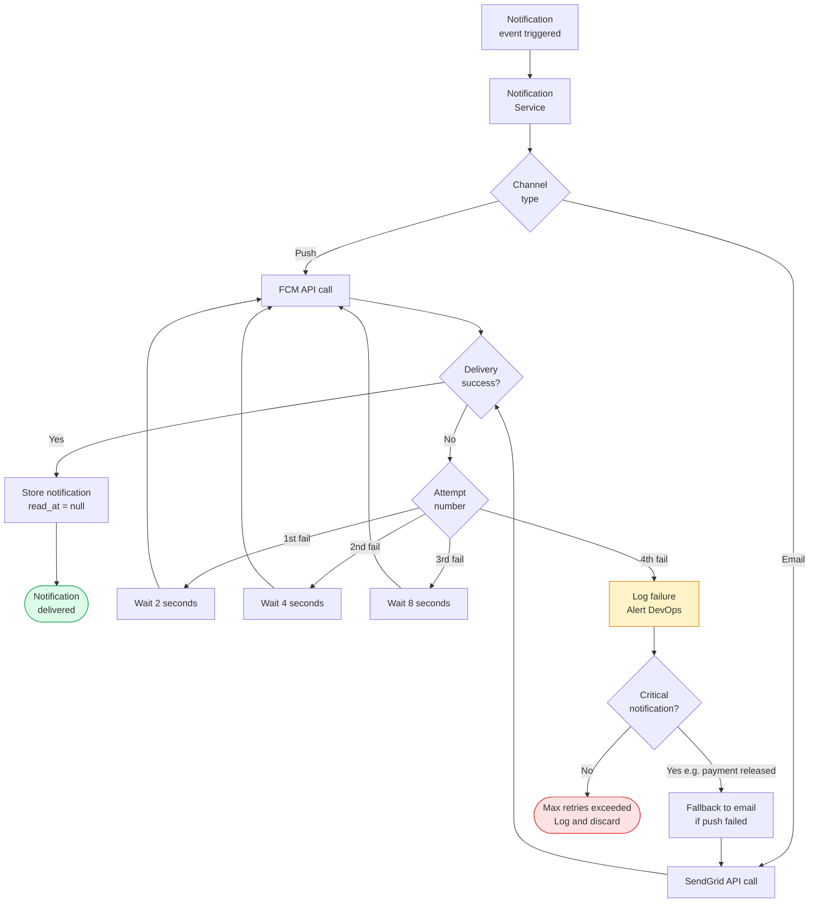

# Diagram 12 – Notification Flow Diagram

## 12A – Notification Trigger Map

```mermaid
flowchart TD
    subgraph TRIGGERS["EVENT TRIGGERS"]
        T1["User registers"]
        T2["Admin approves/rejects document"]
        T3["Supplier submits quote"]
        T4["Haulier confirms booking"]
        T5["Haulier does NOT select supplier"]
        T6["Escrow payment captured"]
        T7["Driver submits delivery report"]
        T8["Haulier approves delivery"]
        T9["Haulier disputes delivery"]
        T10["ETA deviation > 30 min"]
        T11["Job status = COMPLETED"]
    end

    subgraph NS["NOTIFICATION SERVICE"]
        N[Notification\nService]
    end

    subgraph CHANNELS["DISPATCH CHANNELS"]
        EMAIL["✉️ SendGrid\n(Email)"]
        PUSH["🔔 Firebase\nCloud Messaging"]
        INAPP["🔔 In-App\nNotification Centre"]
    end

    subgraph RECIPIENTS["RECIPIENTS & MESSAGES"]
        R1["New user →\nEmail verification link"]
        R2["Supplier →\n'Docs approved/rejected'"]
        R3["Haulier →\n'New quote received'"]
        R4["Selected supplier →\n'You have been booked'"]
        R5["Rejected suppliers →\n'Another supplier selected'"]
        R6["Supplier →\n'Payment secured ✓'"]
        R7["Haulier →\n'Delivery report submitted'"]
        R8["Supplier →\n'Payment released!'"]
        R9["Supplier →\n'Dispute raised'"]
        R10["Haulier →\n'Driver running ~X min late'"]
        R11["Both parties →\n'Rate your experience'"]
    end

    T1 --> N --> R1
    T2 --> N --> R2
    T3 --> N --> R3
    T4 --> N --> R4
    T5 --> N --> R5
    T6 --> N --> R6
    T7 --> N --> R7
    T8 --> N --> R8
    T9 --> N --> R9
    T10 --> N --> R10
    T11 --> N --> R11

    R1 --> EMAIL
    R2 --> EMAIL & PUSH & INAPP
    R3 --> EMAIL & PUSH & INAPP
    R4 --> EMAIL & PUSH & INAPP
    R5 --> EMAIL
    R6 --> PUSH & INAPP
    R7 --> EMAIL & PUSH & INAPP
    R8 --> EMAIL & PUSH & INAPP
    R9 --> PUSH & INAPP
    R10 --> PUSH & INAPP
    R11 --> PUSH & INAPP

    style TRIGGERS fill:#FFF7ED,stroke:#EA580C
    style NS fill:#EFF6FF,stroke:#2563EB
    style CHANNELS fill:#F0FDF4,stroke:#16A34A
    style RECIPIENTS fill:#FDF4FF,stroke:#9333EA
```

## 12B – Notification Retry Flow

```mermaid
flowchart TD
    A[Notification\nevent triggered] --> B[Notification\nService]
    B --> C{Channel\ntype}
    C -->|Push| D[FCM API call]
    C -->|Email| E[SendGrid API call]
    D --> F{Delivery\nsuccess?}
    E --> F
    F -->|Yes| G[Store notification\nread_at = null]
    G --> H([Notification\ndelivered])
    F -->|No| I{Attempt\nnumber}
    I -->|1st fail| J[Wait 2 seconds]
    J --> D
    I -->|2nd fail| K[Wait 4 seconds]
    K --> D
    I -->|3rd fail| L[Wait 8 seconds]
    L --> D
    I -->|4th fail| M[Log failure\nAlert DevOps]
    M --> N{Critical\nnotification?}
    N -->|Yes e.g. payment released| O[Fallback to email\nif push failed]
    N -->|No| P([Max retries exceeded\nLog and discard])
    O --> E

    style H fill:#DCFCE7,stroke:#16A34A
    style P fill:#FEE2E2,stroke:#DC2626
    style M fill:#FEF3C7,stroke:#D97706
```
