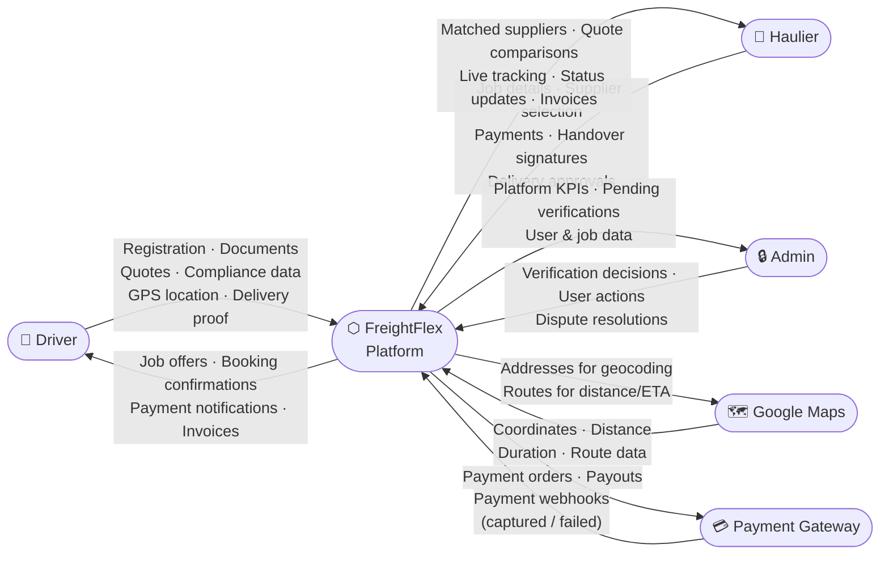
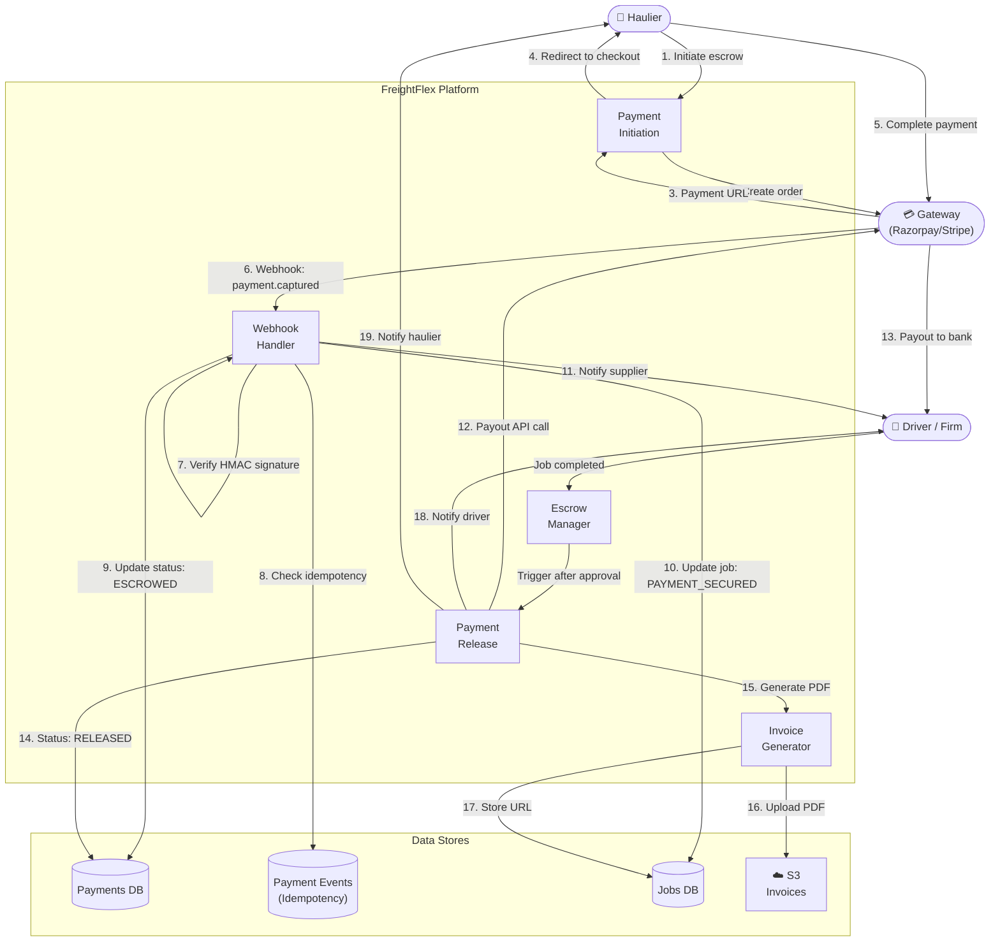

# Diagram 14 – Data Flow Diagrams (DFD)

## 14A – Level 0 DFD (Context Diagram)



## 14B – Level 1 DFD (Main Processes)

```mermaid
flowchart TB
    HAULIER(["🏢 Haulier"])
    DRIVER(["👤 Driver"])
    ADMIN(["🔒 Admin"])
    GMAPS(["🗺️ Google Maps"])
    PGWY(["💳 Payment Gateway"])

    P1["1.0\nUser\nManagement"]
    P2["2.0\nSupplier\nVerification"]
    P3["3.0\nJob Posting\n& Matching"]
    P4["4.0\nBooking &\nPayment"]
    P5["5.0\nCompliance\nWorkflow"]
    P6["6.0\nLive\nTracking"]
    P7["7.0\nRatings &\nReviews"]

    DS1[("Users DB")]
    DS2[("Documents Store\n(S3)")]
    DS3[("Jobs DB")]
    DS4[("Quotes DB")]
    DS5[("Payments DB")]
    DS6[("Compliance DB\n+ Media (S3)")]
    DS7[("Tracking Points\nDB")]
    DS8[("Ratings DB")]

    HAULIER -->|Register · Login · Profile| P1
    DRIVER -->|Register · Login · Profile| P1
    P1 <-->|User records| DS1

    DRIVER -->|Documents| P2
    ADMIN -->|Approve / Reject| P2
    P2 <-->|Document records| DS2
    P2 -->|Verification status| DS1

    HAULIER -->|Job details| P3
    P3 <-->|Address validation| GMAPS
    P3 <-->|Job records| DS3
    P3 <-->|Quote records| DS4
    DRIVER -->|Browse + Quote| P3

    HAULIER -->|Select supplier · Pay| P4
    P4 <-->|Payment orders| PGWY
    P4 <-->|Payment records| DS5
    P4 <-->|Job status updates| DS3

    DRIVER -->|Load code · Checklist · Delivery| P5
    HAULIER -->|Signatures · Approval| P5
    P5 <-->|Compliance records + media| DS6
    P5 -->|Payment release trigger| P4

    DRIVER -->|GPS coordinates| P6
    P6 <-->|Route / ETA| GMAPS
    P6 <-->|Tracking points| DS7
    HAULIER <--|Live location| P6

    HAULIER -->|Rate driver| P7
    DRIVER -->|Rate haulier| P7
    P7 <-->|Rating records| DS8
    P7 -->|Update avg rating| DS1
```

## 14C – Payment Data Flow (Detailed)


