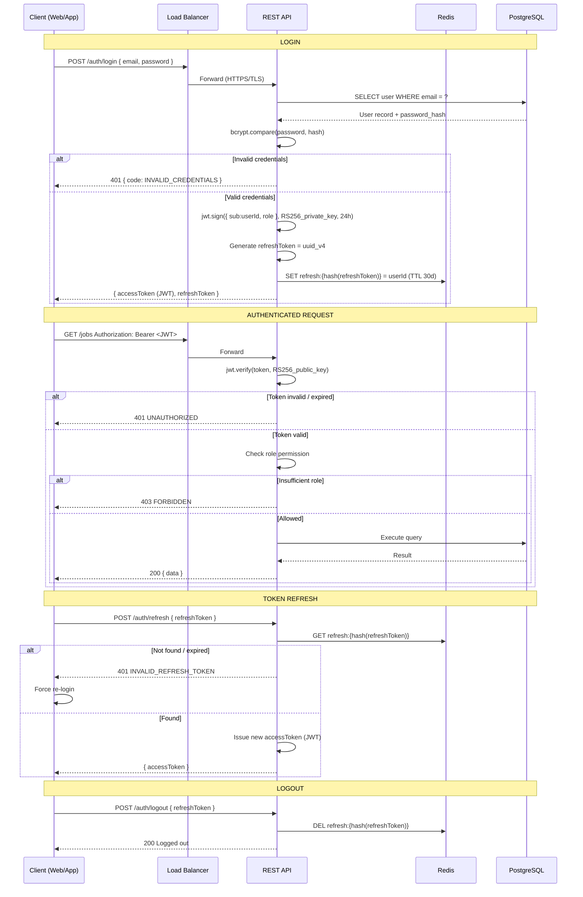

# Diagram 15 – Security & Authentication Flow

## 15A – JWT Authentication Flow



## 15B – RBAC (Role-Based Access Control) Matrix

```mermaid
flowchart TD
    subgraph ROLES["USER ROLES"]
        DR["DRIVER"]
        HA["HAULIER"]
        AD["ADMIN"]
    end

    subgraph RESOURCES["API RESOURCES"]
        AUTH["Auth endpoints\n/auth/*"]
        PROFILE["Own profile\n/users/me"]
        DOCS["Own documents\n/suppliers/documents"]
        AVAIL["Own availability\n/suppliers/availability"]
        JOBS_H["Post/manage jobs\n/jobs (POST · GET own)"]
        JOBS_D["Browse jobs\n/jobs (GET matched)"]
        QUOTES["Submit quotes\n/jobs/:id/quotes"]
        BOOKING["Confirm booking\n/jobs/:id/book"]
        PAYMENT["Initiate payment\n/jobs/:id/payment"]
        COMPLIANCE_D["Driver compliance steps\nload-code · handover · delivery"]
        COMPLIANCE_H["Haulier compliance steps\nsign · approve · dispute"]
        TRACK_D["Send GPS\nWebSocket emit"]
        TRACK_H["View live tracking\n/jobs/:id/tracking"]
        RATINGS["Submit ratings\n/jobs/:id/ratings"]
        ADMIN_RES["Admin resources\n/admin/*"]
    end

    DR -->|✅ Full access| AUTH
    HA -->|✅ Full access| AUTH
    AD -->|✅ Full access| AUTH

    DR -->|✅ Own only| PROFILE
    HA -->|✅ Own only| PROFILE
    AD -->|✅ All users| PROFILE

    DR -->|✅ Own only| DOCS
    DR -->|✅ Own only| AVAIL
    DR -->|❌ No access| JOBS_H
    DR -->|✅ Matched jobs| JOBS_D
    DR -->|✅ Own quotes| QUOTES
    DR -->|❌ No access| BOOKING
    DR -->|❌ No access| PAYMENT
    DR -->|✅ Own steps| COMPLIANCE_D
    DR -->|❌ No access| COMPLIANCE_H
    DR -->|✅ Active job| TRACK_D
    DR -->|❌ No access| TRACK_H
    DR -->|✅ Own jobs| RATINGS
    DR -->|❌ No access| ADMIN_RES

    HA -->|❌ No access| DOCS
    HA -->|❌ No access| AVAIL
    HA -->|✅ Own jobs| JOBS_H
    HA -->|❌ No access| JOBS_D
    HA -->|❌ No access| QUOTES
    HA -->|✅ Own jobs| BOOKING
    HA -->|✅ Own jobs| PAYMENT
    HA -->|❌ No access| COMPLIANCE_D
    HA -->|✅ Own jobs| COMPLIANCE_H
    HA -->|❌ No access| TRACK_D
    HA -->|✅ Own jobs| TRACK_H
    HA -->|✅ Own jobs| RATINGS
    HA -->|❌ No access| ADMIN_RES

    AD -->|✅ All| ADMIN_RES

    style DR fill:#DBEAFE,stroke:#2563EB
    style HA fill:#DCFCE7,stroke:#16A34A
    style AD fill:#FEF3C7,stroke:#D97706
```



## 15C – File Upload Security Flow

```mermaid
flowchart TD
    A([User selects\nfile to upload]) --> B[/POST multipart\nform-data/]
    B --> C{File size\n≤ 10 MB?}
    C -->|No| D[❌ Reject:\n'File too large'\nMax 10MB]
    C -->|Yes| E{MIME type\nPDF / JPG / PNG?}
    E -->|No| F[❌ Reject:\n'Invalid file type']
    E -->|Yes| G[Check magic bytes\n(actual file header)]
    G --> H{Magic bytes\nmatch declared type?}
    H -->|No - spoofed type| I[❌ Reject:\n'File type mismatch']
    H -->|Yes| J[Upload to\nquarantine bucket]
    J --> K[Run antivirus scan\nClamAV / cloud scanner]
    K --> L{Scan\nresult?}
    L -->|Infected| M[❌ Delete from quarantine\nLog security event\nAlert admin]
    L -->|Clean| N[Move to\nproduction bucket]
    N --> O[Generate pre-signed\nURL TTL = 7 days]
    O --> P[Store S3 URL\nin database]
    P --> Q([Return success\nto user])

    style A fill:#DBEAFE,stroke:#2563EB
    style Q fill:#DCFCE7,stroke:#16A34A
    style D fill:#FEE2E2,stroke:#DC2626
    style F fill:#FEE2E2,stroke:#DC2626
    style I fill:#FEE2E2,stroke:#DC2626
    style M fill:#FEE2E2,stroke:#DC2626
```
